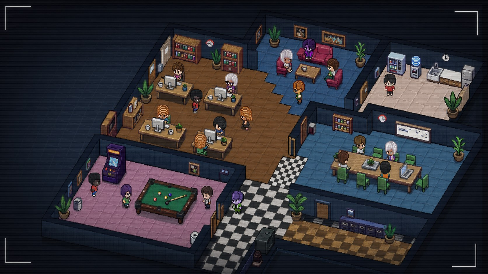

# Agent Pixels


Agent Pixels is a Paperclip plugin that turns your company of AI agents into a live pixel-art office camera.

Learn more at [agent-pixels.com](https://agent-pixels.com).



## What It Does

- Shows Paperclip agents walking around a multi-room pixel office.
- Moves working agents toward desks and idle agents toward lounge, kitchen, boardroom, and games areas.
- Supports multiple camera views across the office layout.
- Includes assignable character sprites so each agent can have a consistent look.
- Expands the original pixel-agent style into a denser company view for larger Paperclip teams.

## Screenshots


## Development

Paperclip should be running before installing or testing the plugin locally. The plugin needs the Paperclip host to load the worker, serve the UI bundle, and expose the plugin bridge.

Install dependencies:

```bash
pnpm install
```

Typecheck:

```bash
pnpm run typecheck
```

Build:

```bash
pnpm run build
```

The build output is written to `dist/`.

## Assets

Character sprites live in:

```text
public/assets/characters/
```

Add new sprites as `char_81.png`, `char_82.png`, etc. The build script auto-detects `char_*.png` files and adds them to the plugin asset index.

## Ready-Made Paperclip Companies

Agent Pixels is free to use. It is also designed to work nicely with ready-made Paperclip company packs that will be available through [agent-pixels.com](https://agent-pixels.com).

Planned company packs include:

- SEO agency
- Game dev agency
- SaaS company
- Full company

More company types are being explored. These packs are intended for people who want a ready-to-run Paperclip company with agents, roles, workflows, and a visual office already set up.

## Support

For feature requests, bugs, or help using Agent Pixels, visit [agent-pixels.com/support](https://www.agent-pixels.com/support).

## What's Next

Planned improvements include:

- More character models and customization options.
- More visual assets, props, and office interactions.
- Adjustable office scale, including desks, meeting rooms, lounges, and floors.
- Additional layouts such as co-working spaces, agency lofts, and high-rise offices.
- Better idle behaviors and animations, including talking, pacing, and coffee runs.

## Contributing

Pull requests are welcome for bug fixes, plugin improvements, new room assets, furniture, and character sprites.

For commercial enquiries, ready-made Paperclip company packs, or larger collaboration ideas, start at [agent-pixels.com](https://agent-pixels.com).
